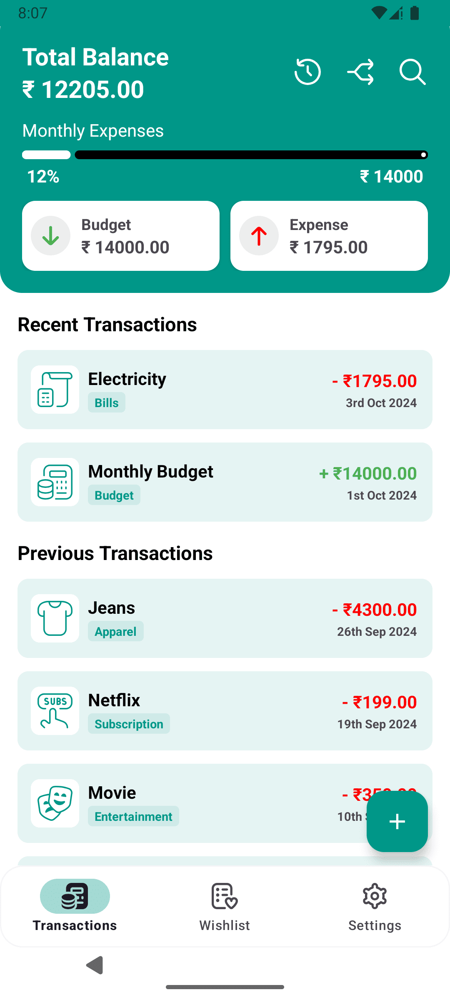
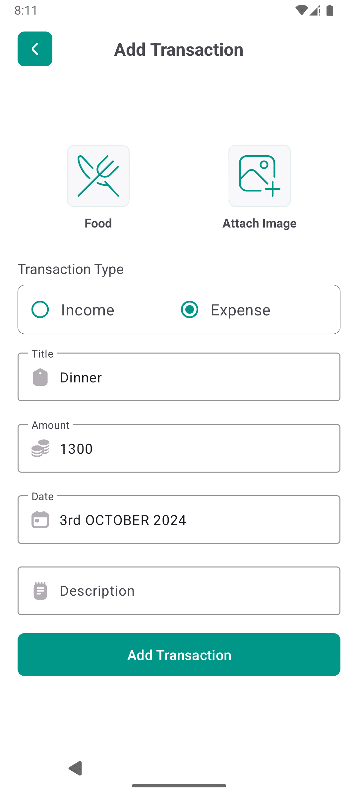
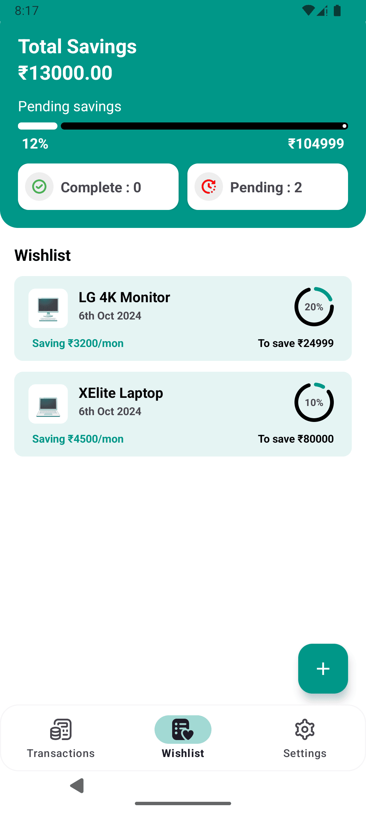
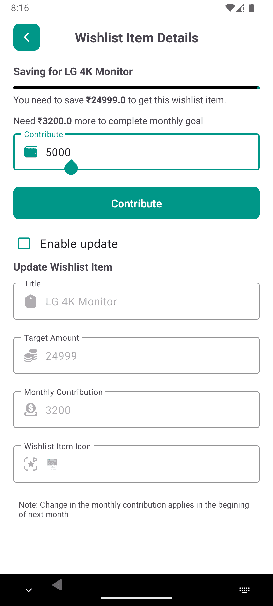
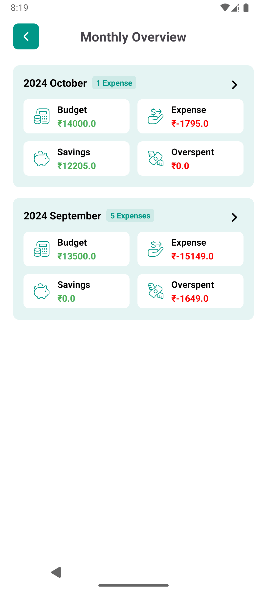
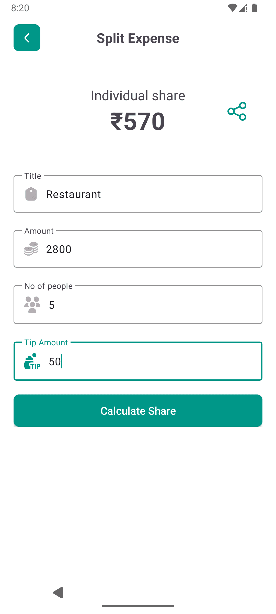

# EaseExpense
A simple and intuitive expense tracking app to help you manage your daily finances. Keep track of your income, expenses, and savings with easy-to-use features. Categorize transactions, set budgets. Perfect for personal finance management!


### Installation
#### Clone the repository using the following command:
```bash    
git clone https://github.com/iamkartiknayak/EaseExpense.git
```
#### Open the project directory in Android Studio to get started
```bash
mv cd ExpenseTracker; ./studio .
```

### Screenshots

&nbsp;&nbsp;&nbsp;
&nbsp;&nbsp;&nbsp;
&nbsp;&nbsp;&nbsp;
&nbsp;&nbsp;&nbsp;
&nbsp;&nbsp;&nbsp;
<br><br>
